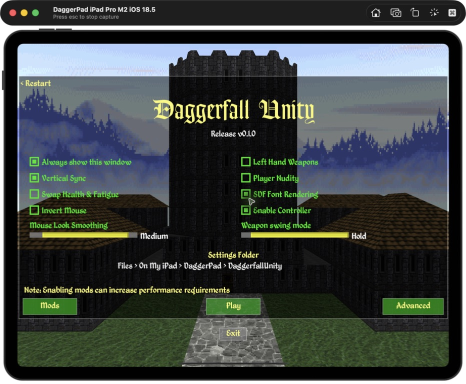
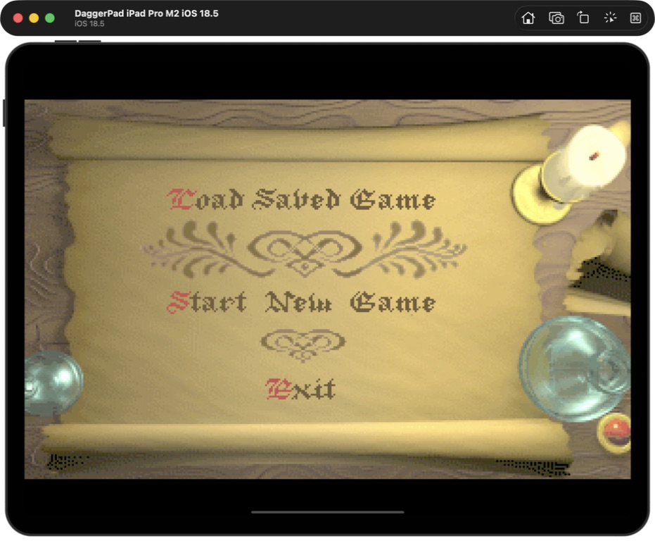
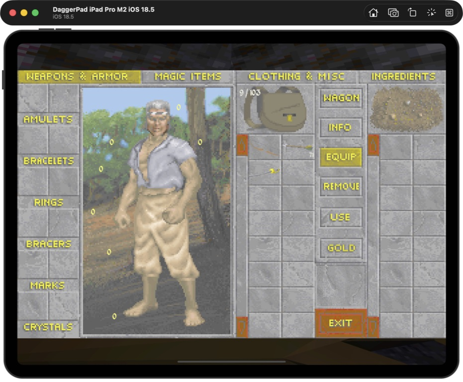
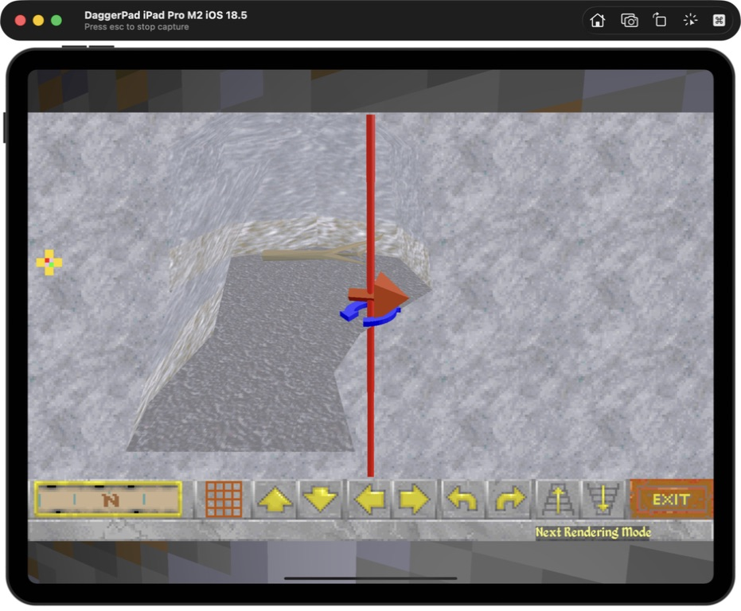
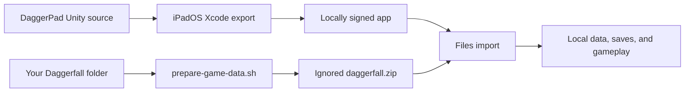

# DaggerPad

<p align="center">
  <strong>The Elder Scrolls II: Daggerfall via Daggerfall Unity, rebuilt for iPad.</strong><br>
  Native Metal rendering, touch-first controls, Files-based setup, and support
  for keyboards, pointing devices, and iPadOS game controllers.
</p>

<p align="center">
  <a href="#get-started"></a>
  <a href="BUILDING.md"></a>
  <a href="#what-works"></a>
  <a href="docs/STATUS.md"></a>
  <a href="#first-launch"></a>
</p>

<p align="center">
  <a href="#get-started"><strong>Install</strong></a> ·
  <a href="#touch-controls"><strong>Controls</strong></a> ·
  <a href="#current-screenshots"><strong>Screenshots</strong></a> ·
  <a href="#frequently-asked-questions"><strong>FAQ</strong></a> ·
  <a href="docs/STATUS.md"><strong>Project status</strong></a>
</p>

<p align="center">
  <a href="docs/PHYSICAL_IPAD_INPUT_REVIEW_2026-07-19.md"></a>
</p>

DaggerPad packages
[Daggerfall Unity](https://github.com/Interkarma/daggerfall-unity) as a native
iPadOS app. It renders through Metal, imports user-provided classic
Daggerfall files through Files, and adds a landscape touch interface designed
for movement, looking, combat, menus, and the original game's dense UI.

The mobile baseline comes from
[Vwing's Daggerfall Unity Android fork](https://github.com/Vwing/daggerfall-unity-android),
with iPadOS integration, native pointer input, Files import, lifecycle handling,
and DaggerPad's touch layouts maintained in this repository. It does **not**
contain Daggerfall, Bethesda game data, or a prepared playable archive.

## Install status

| Option | Status | What to do |
|---|---|---|
| Public `.ipa` | **Not published** | DaggerPad does not currently provide a downloadable binary. Build and sign it locally with your Apple ID. |
| Local iPad build | **Available now** | Follow the fresh-clone instructions below, then sign the generated Xcode project with your Apple development team. |
| Simulator | **Available now** | Best for setup, UI, and repeatable smoke testing; it is not a substitute for physical-device testing. |
| App Store / TestFlight | **Not announced** | No listing or public TestFlight currently exists. |

The current development source has been exported with Unity, signed and built
for arm64, installed over an existing copy, and launched on a 12.9-inch M2
iPad Pro. Device read-back confirmed the version 9 layout, preserved app data
and saves, dedicated Jump and Mount / Dismount controls, the larger Attack
target, and visible Run state.

Those checks prove the build, installation, launch, and device-side
configuration. Hands-on acceptance of the new list scrolling, Run feedback,
mount flow, larger Attack target, accessory feel, and long-session performance
is still open.

## Get started

You need:

- a Mac with [Xcode](https://developer.apple.com/xcode/) and its command-line
  tools;
- [Unity Hub](https://unity.com/download) with Unity `2022.3.62f3` and
  **iOS Build Support** installed;
- an Apple ID configured in Xcode for development signing;
- an iPad running iPadOS 15 or later; and
- your own legally obtained Daggerfall folder containing `ARENA2` and
  `FALL.EXE`.

Clone the project and prepare your game-data ZIP:

```sh
git clone https://github.com/chrissotraidis/daggerpad.git
cd daggerpad
bash scripts/prepare-game-data.sh "/path/to/your/DAGGER"
```

The script validates the folder and writes
`Builds/TestData/daggerfall.zip`. The ZIP stays ignored and must never be
committed or distributed with DaggerPad.

Build and run:

1. Open the repository folder in Unity Hub with `2022.3.62f3`.
2. Let the first Unity import finish.
3. Choose **DaggerPad → Build → iPadOS Device**.
4. Open `Builds/iOS/Device/Unity-iPhone.xcodeproj` in Xcode.
5. Select the `Unity-iPhone` target and choose your development team under
   **Signing & Capabilities**.
6. Connect and trust your iPad, select it as the run destination, and press
   **Run**.

See [`BUILDING.md`](BUILDING.md) for command-line export, signing, Simulator,
and troubleshooting instructions. The complete physical-device handoff is in
[`docs/IPAD_SETUP_AND_CONTROLS.md`](docs/IPAD_SETUP_AND_CONTROLS.md).

<details>
<summary><strong>Prefer a command-line Unity export?</strong></summary>

```sh
/Applications/Unity/Hub/Editor/2022.3.62f3/Unity.app/Contents/MacOS/Unity \
  -batchmode -quit \
  -projectPath "$PWD" \
  -buildTarget iOS \
  -executeMethod DaggerPad.Editor.DaggerPadIosBuild.BuildDevice \
  -daggerpadBuildPath "$PWD/Builds/iOS/Device" \
  -logFile "$PWD/Builds/iOS/unity-device.log"
```

Open the generated Xcode project and choose your development team as described
above. The full signed command-line path is in [`BUILDING.md`](BUILDING.md).
</details>

## First launch

DaggerPad never downloads or bundles game data.

1. Make `Builds/TestData/daggerfall.zip` available in Files, using iCloud
   Drive, AirDrop, or another local transfer method.
2. Launch DaggerPad and tap **Import**.
3. Select `daggerfall.zip` in the Files picker.
4. Let DaggerPad extract and validate the classic game files.
5. Complete setup and tap **Play**.

Imported files, settings, mods, and saves remain visible at
**Files → On My iPad → DaggerPad → DaggerfallUnity**. When updating an existing
installation, keep the same bundle identifier and install in place; uninstalling
deletes the app's data container.

## Touch controls

DaggerPad's standard version 9 iPad layout keeps the game view readable while
placing essential actions within thumb reach:

- **Left half:** touch and drag to move from a floating origin.
- **Right half:** touch and drag to look; double-tap to use, open, or take the
  object under the crosshair.
- **Actions:** Use, Mount / Dismount, Attack, Jump, and Draw / Sheathe sit near
  the right thumb.
- **Commands:** Enter, More, Inventory, Back / Pause, and Edit remain in the
  bottom strip.
- **More:** opens automap, rest, quick save/load, status, travel, journals,
  hand switch, magic items, and a visible Run on/off toggle.
- **Classic lists:** swipe vertically with one finger to scroll conversations,
  inventory-style lists, spell lists, and journals that support mouse-wheel
  input.
- **Customize:** use Edit to move, resize, enable, disable, or remap controls.
  Built-in layouts migrate forward while custom layouts are preserved.

| Surface or control | Gameplay behavior |
|---|---|
| Left half | Move in any direction; touch, keyboard, and controller movement are arbitrated rather than added together. |
| Right half | Look without a permanent on-screen stick. |
| Right-side double tap | Use, activate, open, or take the object under the crosshair. |
| Use | Explicit alternative to the right-side double tap. |
| Mount / Dismount | Mount an owned horse or cart outdoors, or return to foot. |
| Attack | Ready a sheathed weapon on the first tap, then attack. |
| Jump | Trigger Daggerfall's standard Jump action. |
| Enter | Switch the hardware pointer between Pointer mode and captured Look mode. |
| More | Open or close the compact secondary-action tray. |
| Edit | Open the layout editor after closing any open utility tray. |

Hold a visible control briefly to show its name in the HUD, away from the
finger covering the button. The bundled `simplified-layout`, `gesture-layout`,
and `accessibility-layout` presets cover the standard, gesture-combat, and
larger-control starting points.

The current layout, reset behavior, keyboard and trackpad mappings, and
physical retest list are documented in
[`docs/IPAD_SETUP_AND_CONTROLS.md`](docs/IPAD_SETUP_AND_CONTROLS.md).

<details>
<summary><strong>Show keyboard, trackpad, and mouse shortcuts</strong></summary>

| Input | Default behavior |
|---|---|
| `W`, `A`, `S`, `D` | Move at the iPad-tuned keyboard scale |
| Trackpad or mouse motion | Look during captured Look mode |
| Enter | Toggle Pointer mode and Look mode |
| Primary, secondary, middle click | Feed Daggerfall's normal mouse actions and menus |
| `Shift` | Run while held |
| `Space` | Jump |
| `C` | Crouch |
| `M` | Open the automap |
| `I` | Show status |
| `Z` | Ready or sheathe the weapon |
| Escape | Pause, close, or go back |

Daggerfall's normal bindings remain configurable. Pointer lock is requested
only during active gameplay, not while classic menus are open.
</details>

## Current screenshots

<table>
  <tr>
    <td width="50%">
      <a href="docs/images/readme/setup.jpeg"></a>
    </td>
    <td width="50%">
      <a href="docs/images/readme/main-menu.jpeg"></a>
    </td>
  </tr>
  <tr>
    <td align="center"><strong>Files-based setup</strong><br>Import once, then keep data and saves visible in Files.</td>
    <td align="center"><strong>Complete local game</strong><br>Start or load Daggerfall directly on the iPad.</td>
  </tr>
</table>

<table>
  <tr>
    <td width="50%">
      <a href="docs/images/readme/inventory.jpeg"></a>
    </td>
    <td width="50%">
      <a href="docs/images/readme/automap.jpeg"></a>
    </td>
  </tr>
  <tr>
    <td align="center"><strong>Inventory and equipment</strong><br>The original item and character interfaces remain intact.</td>
    <td align="center"><strong>Full automap</strong><br>Reach the interior map from touch controls or keyboard.</td>
  </tr>
</table>

The hero image is from a physical-iPad input pass. The four interface captures
are from the verified iOS 18.5 iPad Pro Simulator flow. All game data used for
these captures was supplied locally and is not part of this repository.

## Simulator test

The automated smoke path exports DaggerPad, builds it for the pinned iOS 18.5
iPad Pro Simulator, installs it, launches it, and captures local evidence.

<details>
<summary><strong>Run the automated Simulator smoke path</strong></summary>

```sh
bash scripts/prepare-game-data.sh "/path/to/your/DAGGER"
bash scripts/run-simulator-smoke.sh
```

The script creates or reuses the named test Simulator but intentionally
performs a clean DaggerPad install. Do not point it at a Simulator whose app
data or saves you need to keep. See [`docs/TESTING.md`](docs/TESTING.md) for
the exact evidence boundary and physical-iPad checklist.
</details>

## What works

| Area | Current result |
|---|---|
| Native app | Complete Unity project exports and builds for arm64 iPadOS 15+ through IL2CPP |
| Rendering | Metal rendering works in Simulator and on physical iPad |
| Game setup | Files-based ZIP import, validation, local extraction, and path recovery after app-container relocation work |
| Gameplay | Character creation, Privateer's Hold, pause, inventory, automap, named saves, load, and suspension autosave recovery have been exercised |
| Touch | Dual-zone movement/look, core actions, utility tray, Daggerfall-styled controls, three presets, and an in-app layout editor are included |
| Input options | Touch, keyboard, native `GCMouse` mouse/trackpad input, and the inherited iOS controller path are present |
| Updates | Imported data, custom layouts, and saves can survive an in-place app update |

For detailed engineering evidence and the remaining physical-device gates, see
[`docs/STATUS.md`](docs/STATUS.md) and [`docs/TESTING.md`](docs/TESTING.md).

## Supported game

| Game | Engine | Status |
|---|---|---|
| **The Elder Scrolls II: Daggerfall** | [Daggerfall Unity](https://github.com/Interkarma/daggerfall-unity) | Supported with user-provided classic game files |
| Other Elder Scrolls games | — | Not supported by this app |

DaggerPad is a native Daggerfall Unity integration, not a DOS emulator or a
general Elder Scrolls launcher.

## Reproducible and game-data-free



The app build never needs to bundle your Daggerfall files. The preparation
script creates a separate ignored ZIP from the folder you provide, and the app
introduces that data only after installation through the iPadOS Files picker.

Before handing off a source build, run:

```sh
bash scripts/verify-source.sh "/path/to/your/DAGGER"
bash scripts/verify-xcode-export.sh Builds/iOS/Device
```

The first command checks the pinned Unity/iPadOS configuration, touch contract,
the game-data folder you provide, script syntax, and whitespace. If you omit
the folder, local game-data checks run only when the default ignored `ref/`
folder exists. The second command checks a generated Xcode export for
Addressables, Files integration, iPad targeting, indirect input, and the native
pointer framework.

Generated Unity state, Xcode projects, build products, prepared ZIPs, classic
game files, saves, and local evidence are ignored and must never be committed.

## Important limits

- DaggerPad is an unofficial community port. You must supply your own
  Daggerfall files.
- iPadOS uses IL2CPP. Runtime C# mods and precompiled managed mod assemblies do
  not work; asset-only mods must be rebuilt for the iOS Unity target.
- A build, installed bundle, launched process, or device-side preset read-back
  does not by itself prove physical control feel or long-session stability.
- Physical controller mappings, sustained performance, thermals, battery use,
  memory, interruption recovery, and a desktop-to-iPad save round trip still
  need broader device testing.
- No public IPA, App Store build, or TestFlight is currently offered.

## Frequently asked questions

<details>
<summary><strong>Where is the IPA?</strong></summary>

There is no public DaggerPad IPA yet. Build the app locally, select your Apple
development team in Xcode, and install it with your own signing identity.
</details>

<details>
<summary><strong>Does this repository include Daggerfall?</strong></summary>

No. You must provide your own legally obtained classic Daggerfall folder. Do
not open issues requesting game data or download links.
</details>

<details>
<summary><strong>Does it really run on a physical iPad?</strong></summary>

Yes. Development builds have been signed, installed, launched, and exercised
on a 12.9-inch M2 iPad Pro. The current version 9 build and layout configuration
are present on that device, but its newest touch changes and longer performance
passes still require hands-on acceptance.
</details>

<details>
<summary><strong>Can I customize the touch controls?</strong></summary>

Yes. Open Edit to move, resize, hide, enable, or remap controls. DaggerPad ships
standard, gesture-combat, and accessibility presets and preserves user-created
layouts during built-in preset migrations.
</details>

<details>
<summary><strong>Does it support a keyboard, trackpad, mouse, or controller?</strong></summary>

Keyboard movement and shortcuts are included. Mouse and trackpad input use a
native `GCMouse` bridge with gameplay-only pointer lock. Daggerfall Unity's
controller path is also present, but physical controller mappings and accessory
feel still need model-specific testing.
</details>

<details>
<summary><strong>Do Daggerfall Unity mods work?</strong></summary>

Asset-only mods can work when rebuilt for the iOS Unity target. Runtime C# mods
and precompiled managed mod assemblies are incompatible with the IL2CPP build.
</details>

<details>
<summary><strong>Is this an App Store or TestFlight release?</strong></summary>

No. App Store, TestFlight, and public sideload distribution require separate
signing, packaging, testing, and rights review. None has been announced.
</details>

<details>
<summary><strong>What is the licensing status?</strong></summary>

Daggerfall Unity and the Vwing mobile fork are MIT-licensed. This repository
carries the Daggerfall Workshop MIT license in [`LICENSE`](LICENSE), while
bundled third-party components retain their own notices under
[`Assets/Licenses/`](Assets/Licenses/). The license does not grant rights to
Bethesda's classic game files, names, or trademarks. Those game files are not
bundled with DaggerPad.
</details>

## Project map

| Path | Purpose |
|---|---|
| [`Assets/iOS/`](Assets/iOS/) | iPadOS build, lifecycle, Files, and platform integration |
| [`Assets/Plugins/iOS/`](Assets/Plugins/iOS/) | Native mouse and trackpad bridge |
| [`Assets/Android/Scripts/`](Assets/Android/Scripts/) | Shared mobile touch controls and layout management |
| [`scripts/prepare-game-data.sh`](scripts/prepare-game-data.sh) | Validate local classic files and create the ignored import ZIP |
| [`scripts/run-simulator-smoke.sh`](scripts/run-simulator-smoke.sh) | Deterministic iPad Simulator build, install, launch, and evidence path |
| [`scripts/verify-source.sh`](scripts/verify-source.sh) | Source, configuration, touch, and optional local-data gate |
| [`BUILDING.md`](BUILDING.md) | Fresh-clone build, signing, Simulator, and troubleshooting guide |
| [`docs/IPAD_SETUP_AND_CONTROLS.md`](docs/IPAD_SETUP_AND_CONTROLS.md) | Physical-iPad setup, safe updates, controls, and acceptance checklist |
| [`docs/STATUS.md`](docs/STATUS.md) | Implementation evidence and current boundaries |
| [`docs/TESTING.md`](docs/TESTING.md) | Simulator and physical-device test matrix |

Generated source state, build directories, app products, prepared game-data
archives, and user saves are local-only and ignored.

## Feedback and contributing

Use [GitHub Issues](https://github.com/chrissotraidis/daggerpad/issues) for
reproducible gameplay or platform defects. Include the DaggerPad commit, iPad
model, iPadOS version, and exact reproduction steps. Never attach or request
game data, prepared archives, or saves containing copyrighted material.

## Legal and acknowledgements

DaggerPad is an unofficial community project and is not affiliated with or
endorsed by Bethesda Softworks, ZeniMax Media, Unity Technologies, Daggerfall
Workshop, or the Vwing project. It does not provide the game, game downloads,
or prepared playable data.

This project builds on Daggerfall Unity, Vwing's mobile work, Unity, Native
File Picker, and their contributors. All projects, copyrights, and trademarks
belong to their respective owners.
