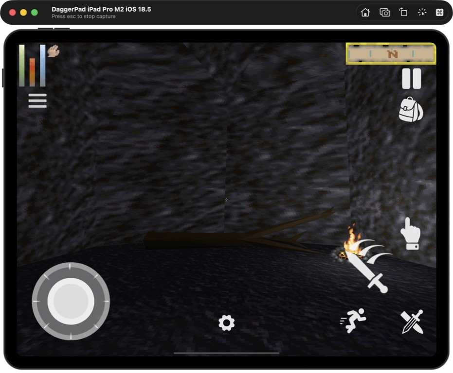

# DaggerPad

Native Daggerfall on iPad. DaggerPad builds Daggerfall Unity for iPadOS, adds a touch-first HUD, and imports the classic game files you already own. No streaming, server, or Bethesda data is bundled.

<p align="center">
  
</p>

## Install on an iPad

You need:

- A Mac with [Xcode](https://developer.apple.com/xcode/) and a free or paid Apple developer account.
- [Unity Hub](https://unity.com/download) with Unity `2022.3.62f3` and **iOS Build Support** installed.
- An iPad running iPadOS 15 or later.
- Your own legally obtained Daggerfall game folder. It must contain `ARENA2` and `FALL.EXE`.

### 1. Get the project

```bash
git clone https://github.com/chrissotraidis/daggerpad.git
cd daggerpad
```

Open the repository folder as a project in Unity Hub. Use the exact editor version above when Hub prompts you.

### 2. Prepare your game-data ZIP

Pass the folder that directly contains `ARENA2` and `FALL.EXE`:

```bash
bash scripts/prepare-game-data.sh "/path/to/your/DAGGER"
```

The script validates the folder and creates `Builds/TestData/daggerfall.zip`. DaggerPad never commits or distributes this archive.

### 3. Build and run

1. In Unity, choose **DaggerPad > Build > iPadOS Device**.
2. Open `Builds/iOS/Device/Unity-iPhone.xcodeproj` in Xcode.
3. Select the `Unity-iPhone` target, open **Signing & Capabilities**, and choose your development team.
4. Connect and trust your iPad, select it as the run destination, then press **Run**.
5. On the iPad, open DaggerPad, tap **Import**, choose `daggerfall.zip` in Files, finish setup, and tap **Play**.

The imported files and saves are visible at **Files > On My iPad > DaggerPad > DaggerfallUnity**.

<table>
  <tr>
    <td width="50%"></td>
    <td width="50%"></td>
  </tr>
  <tr>
    <td align="center"><sub>Import once, then keep the data in Files.</sub></td>
    <td align="center"><sub>Start or load Daggerfall locally on the iPad.</sub></td>
  </tr>
</table>

For the complete physical-iPad handoff, including in-place updates, controls, resets, and known gates, see [iPad setup and controls](docs/IPAD_SETUP_AND_CONTROLS.md). Command-line exports and common fixes are also summarized in [BUILDING.md](BUILDING.md).

## Controls

| Input | Gameplay |
| --- | --- |
| Touch | Use the left half of the screen as a movement pad and the right half to look. Double-tap the right look surface to use or take the object under the crosshair. Use, Attack, and Draw sit in a lower-right thumb cluster; Enter, More, Inventory, Back, and Edit form the bottom-center strip. Hold any button briefly to show its name away from your thumb. More opens a compact utility tray below Daggerfall's status bars with run, automap, rest, status, quick save/load, travel, journal, hand switch, and magic items. |
| Keyboard | `WASD` moves at a tablet-tuned walking rate, arrow keys turn, `Shift` runs, `Space` jumps, `C` crouches, `M` opens automap, `I` shows status, `Z` readies a weapon, and `Esc` pauses or backs out. Daggerfall's normal bindings remain configurable. |
| Mouse or trackpad | Relative movement looks around. Primary, secondary, and middle buttons feed Daggerfall's normal mouse actions and work in its menus. iPadOS pointer lock is requested only during active gameplay. |
| Controller | The inherited Daggerfall Unity controller path remains available; physical-device mapping is still an acceptance gate. |

Tap the bottom gear to move or remap touch controls. Opening the editor closes More automatically so its utility buttons cannot cover the options panel. DaggerPad includes balanced, gesture, and accessibility presets and preserves custom layouts across updates.

The current physical-device findings and retest checklist are documented in [the July 19 iPad input review](docs/PHYSICAL_IPAD_INPUT_REVIEW_2026-07-19.md).

<table>
  <tr>
    <td width="50%"></td>
    <td width="50%"></td>
  </tr>
  <tr>
    <td align="center"><sub>Inventory, equipment, and item actions remain intact.</sub></td>
    <td align="center"><sub>The full interior automap is available from the touch drawer or keyboard.</sub></td>
  </tr>
</table>

## Simulator test

The automated smoke path installs the pinned iOS 18.5 iPad Pro Simulator, builds the app, launches it, and captures evidence:

```bash
bash scripts/prepare-game-data.sh "/path/to/your/DAGGER"
bash scripts/run-simulator-smoke.sh
```

The smoke script creates or reuses the named test Simulator but intentionally performs a clean app install, so do not run it against a Simulator whose DaggerPad data you need to keep. See [docs/TESTING.md](docs/TESTING.md) for the current playtest boundary and physical-iPad checklist.

## Current state

Proven on the M2 iPad Pro Simulator:

- Files import and validation of classic Daggerfall data.
- Main menu, character creation, Privateer's Hold, touch HUD, pause, inventory, automap, named saves, load, and suspension autosave recovery.
- Keyboard movement, turning, pause, status, and letter shortcuts.
- A native `GCMouse` path for raw mouse and trackpad deltas and buttons, with a clean Unity export and Xcode build. The Simulator exposes the device connection but its automation layer does not emit physical `GCMouse` deltas; final feel and button verification remain a physical-iPad gate.

The detailed run is in [docs/PLAYTEST_2026-07-17.md](docs/PLAYTEST_2026-07-17.md). Project requirements and coverage live in [the PRD](docs/DAGGERPAD_PRD.md) and [coverage ledger](docs/PRD_COVERAGE.md).

## Important limits

- DaggerPad is an unofficial port. You must supply your own Daggerfall files.
- iOS uses IL2CPP. Runtime C# mods and precompiled managed mod assemblies do not work; asset-only mods must be rebuilt for the iOS Unity target.
- A Simulator pass proves build and UI behavior, not physical-device performance, thermals, lifecycle termination, or accessory feel.
- Daggerfall Unity and the Vwing mobile fork are MIT-licensed. See [LICENSE](LICENSE) and `Assets/Licenses/`.

## Project docs

- [iPad setup and controls](docs/IPAD_SETUP_AND_CONTROLS.md)
- [Build and installation](BUILDING.md)
- [Simulator and physical-device testing](docs/TESTING.md)
- [Current implementation status](docs/STATUS.md)
- [Goal-based delivery loop](docs/DAGGERPAD_GOAL_LOOP.md)
- [Product requirements](docs/DAGGERPAD_PRD.md)
- [PRD coverage](docs/PRD_COVERAGE.md)

DaggerPad is not affiliated with or endorsed by Bethesda Softworks, ZeniMax Media, or Unity Technologies.
