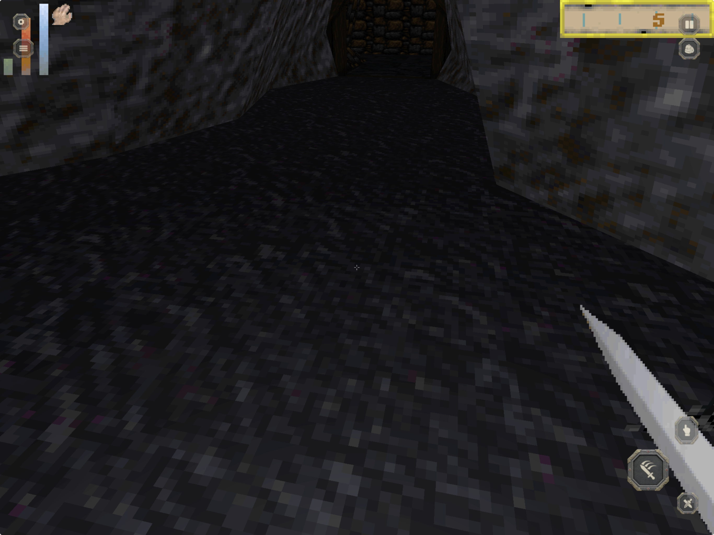
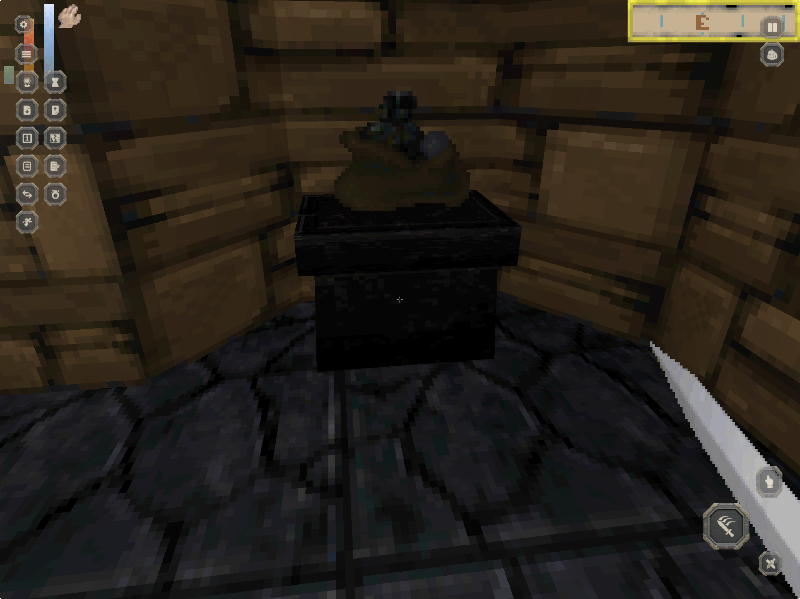

# DaggerPad touch controls: physical iPad audit, pass 3

## Audit scope

Two 2048 x 1366 physical-iPad screenshots and the reported movement, keyboard, menu-recovery, and control-discoverability behavior. The goal is simultaneous left-thumb movement and right-thumb look without obscuring Daggerfall's native HUD.

## Step 1: normal gameplay - blocked

Strengths: the themed buttons now fit the game and leave most of the view unobstructed. Look input works on the right half.

Risks: the right action stack occupies the weapon-rendering area; the buttons are slightly too small; the gear and More buttons collide with Daggerfall's status column; pressed state and purpose are hard to read. The visible left pad appears but does not continuously feed movement. Physical WASD is too strong and can combine with legacy controller axes.

## Step 2: More drawer open - poor

Strengths: the drawer exposes useful actions in one place and the icon language is reasonably consistent.

Risks: the two-column utility wall covers the native health/status area and consumes the left movement surface. Icons have no discoverable names. Enter is absent from the default strip. Rest can open a paused window after the touch overlay disappears, leaving a touch-only player without a clear Back control.

## Version 5 recommendations implemented

1. Track the movement finger every frame rather than depending on UI drag callbacks.
2. Give touch, keyboard, and controller movement exclusive ownership per frame; preserve analog direction and reduce iPad keyboard movement to 55 percent.
3. Move Use, Attack, and Draw to the middle-right, away from the rendered weapon.
4. Move Enter, More, Inventory, and Back to a bottom-center command strip.
5. Open utilities as a top-center two-row tray, away from the native left HUD and right compass.
6. Enlarge utility targets to 64 points, core controls to 68-100 points, and Enter to 112 x 64.
7. Add a strong gold tint plus 12 percent press scale, and reveal the control name after a 0.35-second hold.
8. Keep only Back and Enter visible in paused Daggerfall windows so Rest and other menus are recoverable by touch.
9. Show a one-time hint: left to move, right to look, and the hand to use or take an object.

## Evidence limits

The screenshots establish placement, hierarchy, overlap, and target-size problems. They cannot prove movement values, multi-touch arbitration, press feedback timing, menu recovery, or keyboard feel; those require the rebuilt app on the physical iPad.
