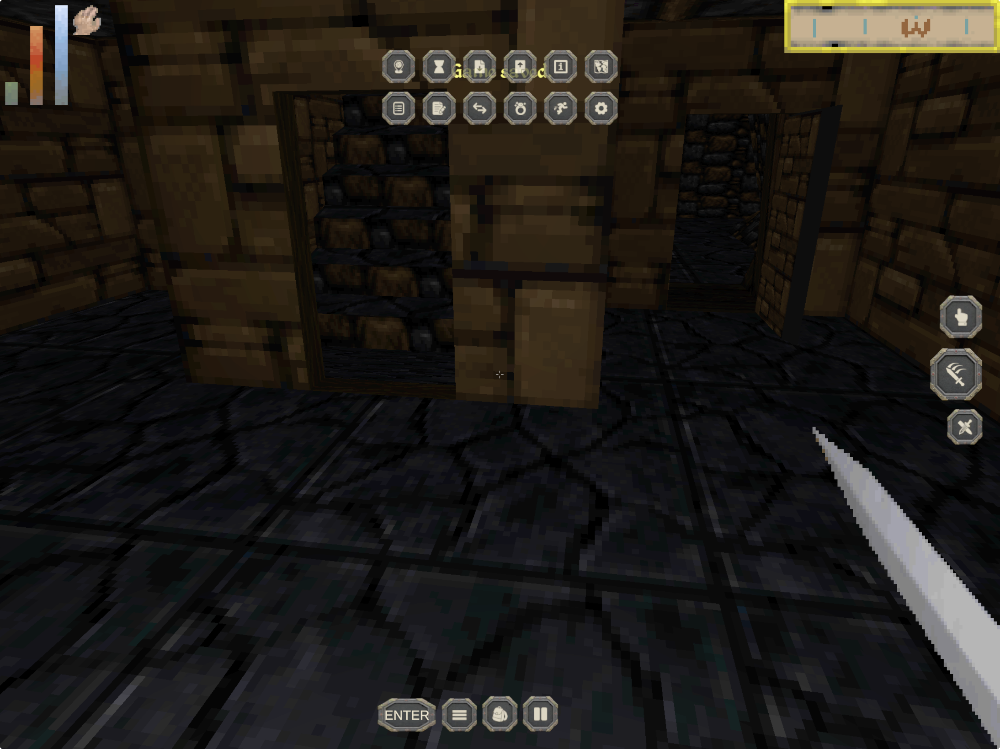
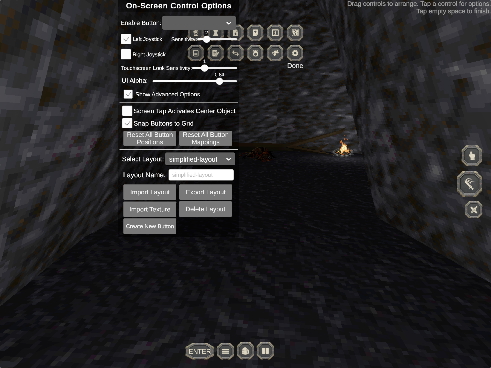

# Touch controls fourth-pass audit

Date: 2026-07-19
Surface: physical iPad gameplay HUD and on-screen control editor
User goal: move and look together, use the essential actions reliably, and customize controls without overlapping UI

## Overall verdict

Movement is now functional and its sensitivity is the first clearly successful part of the touch scheme. The remaining version 5 experience is not shippable because primary actions are dead and two overlay systems occupy the same space. Version 6 addresses the shared action regression first, then reduces and separates the overlay layers without changing the accepted movement feel.

## Steps and findings

### 1. Gameplay with More open — unhealthy

Strength: the bottom command strip and themed icon family are substantially calmer than the original phone layout. Risks: the utility tray covers the center status-message lane, the held label collides with tray icons, Enter text is oversized, and the right action stack is separated from the lower-right look-thumb area. Physical input also established that Use, Attack, Draw, Inventory, and Pause did not fire.

Version 6 response: restore the standard bound-key path; move the action stack lower; move the utility tray beneath the native status bars; use one HUD label away from the thumb; cap Enter text size.

### 2. Control editor with More open — unhealthy

Strength: the editor exposes the relevant layout, sensitivity, opacity, and reset controls. Risks: More remains layered over the editor's toggles and sliders, producing ambiguous hit targets and unreadable values. The Done affordance is visually detached from the editor.

Version 6 response: keep Edit as a standalone bottom-strip action and close every drawer before the editor appears.

## Accessibility risks

- The version 5 overlapping controls do not provide reliable target separation.
- Labels beneath the active finger are not perceivable at the moment they are needed.
- Dead actions provide visual affordances without functional equivalence.
- Screenshot evidence cannot verify VoiceOver semantics, focus order, contrast ratios, or simultaneous multi-touch behavior.

## Evidence limits

These screenshots document the version 5 failure state. Source validation and a signed iPad install can prove that version 6 was built and deployed, but only another hands-on physical pass can confirm thumb comfort, multi-touch continuity, and in-game action results.
